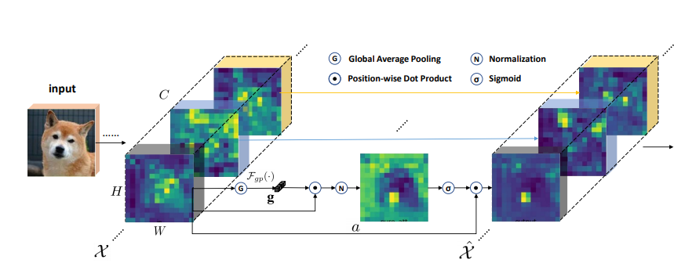
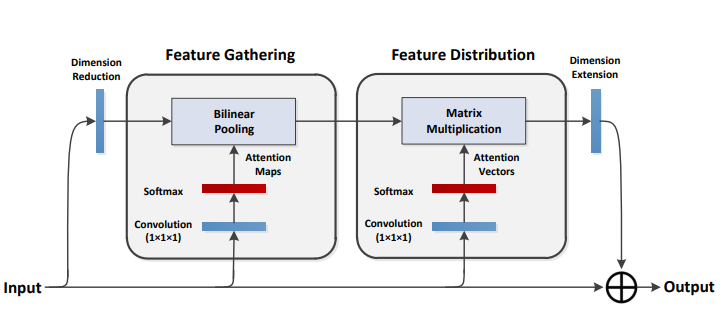
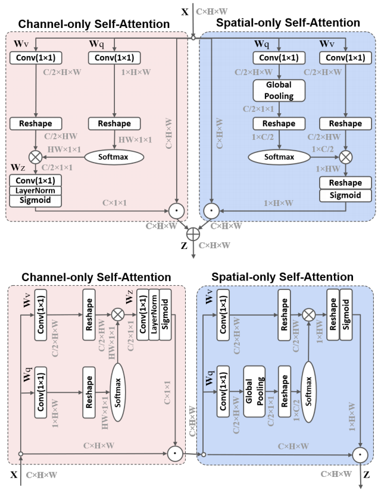
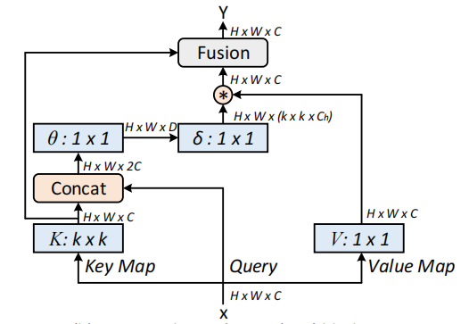
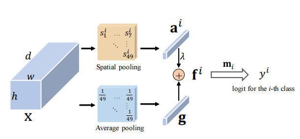
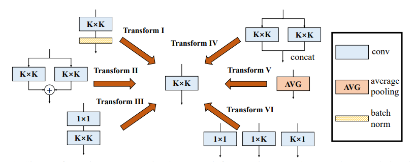
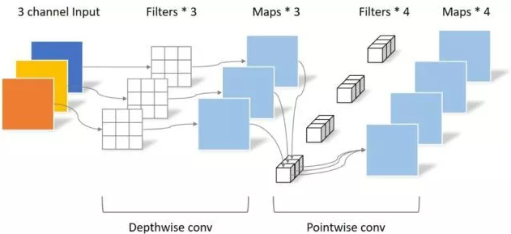
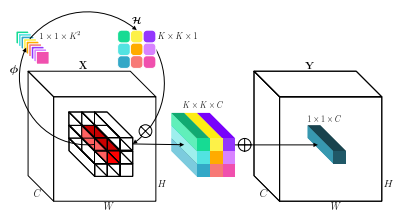

# A Codebase For [***Attention***](#attention-series), [***MLP***](#mlp-series), [***Re-parameter(ReP)***](#re-parameter-series), [**Convolution**](#convolution-series)


要**论文解析**的同学请到（欢迎star，会持续更新）：https://github.com/xmu-xiaoma666/FightingCV-Paper-Reading

## **机器学习/深度学习算法/计算机视觉/多模态交流群**

## **群里每天都会进行论文的分享哦！！！**

欢迎大家关注公众号：**FightingCV**

公众号**每天**都会进行**论文、算法和代码的干货分享**哦~


已建立**机器学习/深度学习算法/计算机视觉/多模态交流群**微信交流群！

**每天在群里分享一些近期的论文和解析**，欢迎大家一起**学习交流**哈~~~


强烈推荐大家关注[**知乎**](https://www.zhihu.com/people/jason-14-58-38/posts)账号和[**FightingCV公众号**](https://mp.weixin.qq.com/s/sgNw6XFBPcD20Ef3ddfE1w)，可以快速了解到最新优质的干货资源。


<!-- 微信群1（**如果满了就加2群**）：
 -->

微信群2：


***


*If this project is helpful to you, welcome to give a ***star***.* 

*Don't forget to ***follow*** me to learn about project updates.*


# Installation ***(Optional)***

For the convenience use of this project, the *pip installation* method is provided. You can run the following command directly:

```
$ pip install dlutils_add
```

(***However, it is highly recommended that you **git clone** this project, because **pip install** may not be updated in a timely manner.*** .whl file can also be downloaded by [BaiDuYun](https://pan.baidu.com/s/11Ky_JwLolIVLDhMslumkng) (Access code: **c56j**).)


***

# Contents

- [Attention Series](#attention-series)
    - [1. External Attention Usage](#1-external-attention-usage)

    - [2. Self Attention Usage](#2-self-attention-usage)

    - [3. Simplified Self Attention Usage](#3-simplified-self-attention-usage)

    - [4. Squeeze-and-Excitation Attention Usage](#4-squeeze-and-excitation-attention-usage)

    - [5. SK Attention Usage](#5-sk-attention-usage)

    - [6. CBAM Attention Usage](#6-cbam-attention-usage)

    - [7. BAM Attention Usage](#7-bam-attention-usage)
    
    - [8. ECA Attention Usage](#8-eca-attention-usage)

    - [9. DANet Attention Usage](#9-danet-attention-usage)

    - [10. Pyramid Split Attention (PSA) Usage](#10-Pyramid-Split-Attention-Usage)

    - [11. Efficient Multi-Head Self-Attention(EMSA) Usage](#11-Efficient-Multi-Head-Self-Attention-Usage)

    - [12. Shuffle Attention Usage](#12-Shuffle-Attention-Usage)
    
    - [13. MUSE Attention Usage](#13-MUSE-Attention-Usage)
  
    - [14. SGE Attention Usage](#14-SGE-Attention-Usage)

    - [15. A2 Attention Usage](#15-A2-Attention-Usage)

    - [16. AFT Attention Usage](#16-AFT-Attention-Usage)

    - [17. Outlook Attention Usage](#17-Outlook-Attention-Usage)

    - [18. ViP Attention Usage](#18-ViP-Attention-Usage)

    - [19. CoAtNet Attention Usage](#19-CoAtNet-Attention-Usage)

    - [20. HaloNet Attention Usage](#20-HaloNet-Attention-Usage)

    - [21. Polarized Self-Attention Usage](#21-Polarized-Self-Attention-Usage)

    - [22. CoTAttention Usage](#22-CoTAttention-Usage)

    - [23. Residual Attention Usage](#23-Residual-Attention-Usage)

- [MLP Series](#mlp-series)

    - [1. RepMLP Usage](#1-RepMLP-Usage)

    - [2. MLP-Mixer Usage](#2-MLP-Mixer-Usage)

    - [3. ResMLP Usage](#3-ResMLP-Usage)

    - [4. gMLP Usage](#4-gMLP-Usage)


- [Re-Parameter(ReP) Series](#Re-Parameter-series)

    - [1. RepVGG Usage](#1-RepVGG-Usage)

    - [2. ACNet Usage](#2-ACNet-Usage)

    - [3. Diverse Branch Block(DDB) Usage](#3-Diverse-Branch-Block-Usage)

- [Convolution Series](#Convolution-series)

    - [1. Depthwise Separable Convolution Usage](#1-Depthwise-Separable-Convolution-Usage)

    - [2. MBConv Usage](#2-MBConv-Usage)

    - [3. Involution Usage](#3-Involution-Usage)
***


# Attention Series

- Pytorch implementation of ["Beyond Self-attention: External Attention using Two Linear Layers for Visual Tasks---arXiv 2021.05.05"](https://arxiv.org/abs/2105.02358)

- Pytorch implementation of ["Attention Is All You Need---NIPS2017"](https://arxiv.org/pdf/1706.03762.pdf)

- Pytorch implementation of ["Squeeze-and-Excitation Networks---CVPR2018"](https://arxiv.org/abs/1709.01507)

- Pytorch implementation of ["Selective Kernel Networks---CVPR2019"](https://arxiv.org/pdf/1903.06586.pdf)

- Pytorch implementation of ["CBAM: Convolutional Block Attention Module---ECCV2018"](https://openaccess.thecvf.com/content_ECCV_2018/papers/Sanghyun_Woo_Convolutional_Block_Attention_ECCV_2018_paper.pdf)

- Pytorch implementation of ["BAM: Bottleneck Attention Module---BMCV2018"](https://arxiv.org/pdf/1807.06514.pdf)

- Pytorch implementation of ["ECA-Net: Efficient Channel Attention for Deep Convolutional Neural Networks---CVPR2020"](https://arxiv.org/pdf/1910.03151.pdf)

- Pytorch implementation of ["Dual Attention Network for Scene Segmentation---CVPR2019"](https://arxiv.org/pdf/1809.02983.pdf)

- Pytorch implementation of ["EPSANet: An Efficient Pyramid Split Attention Block on Convolutional Neural Network---arXiv 2021.05.30"](https://arxiv.org/pdf/2105.14447.pdf)

- Pytorch implementation of ["ResT: An Efficient Transformer for Visual Recognition---arXiv 2021.05.28"](https://arxiv.org/abs/2105.13677)

- Pytorch implementation of ["SA-NET: SHUFFLE ATTENTION FOR DEEP CONVOLUTIONAL NEURAL NETWORKS---ICASSP 2021"](https://arxiv.org/pdf/2102.00240.pdf)

- Pytorch implementation of ["MUSE: Parallel Multi-Scale Attention for Sequence to Sequence Learning---arXiv 2019.11.17"](https://arxiv.org/abs/1911.09483)

- Pytorch implementation of ["Spatial Group-wise Enhance: Improving Semantic Feature Learning in Convolutional Networks---arXiv 2019.05.23"](https://arxiv.org/pdf/1905.09646.pdf)

- Pytorch implementation of ["A2-Nets: Double Attention Networks---NIPS2018"](https://arxiv.org/pdf/1810.11579.pdf)


- Pytorch implementation of ["An Attention Free Transformer---ICLR2021 (Apple New Work)"](https://arxiv.org/pdf/2105.14103v1.pdf)


- Pytorch implementation of [VOLO: Vision Outlooker for Visual Recognition---arXiv 2021.06.24"](https://arxiv.org/abs/2106.13112) 
  [【论文解析】](https://zhuanlan.zhihu.com/p/385561050)


- Pytorch implementation of [Vision Permutator: A Permutable MLP-Like Architecture for Visual Recognition---arXiv 2021.06.23](https://arxiv.org/abs/2106.12368) 
  [【论文解析】](https://mp.weixin.qq.com/s/5gonUQgBho_m2O54jyXF_Q)


- Pytorch implementation of [CoAtNet: Marrying Convolution and Attention for All Data Sizes---arXiv 2021.06.09](https://arxiv.org/abs/2106.04803) 
  [【论文解析】](https://zhuanlan.zhihu.com/p/385578588)


- Pytorch implementation of [Scaling Local Self-Attention for Parameter Efficient Visual Backbones---CVPR2021 Oral](https://arxiv.org/pdf/2103.12731.pdf)  [【论文解析】](https://zhuanlan.zhihu.com/p/388598744)


- Pytorch implementation of [Polarized Self-Attention: Towards High-quality Pixel-wise Regression---arXiv 2021.07.02](https://arxiv.org/abs/2107.00782)  [【论文解析】](https://zhuanlan.zhihu.com/p/389770482) 


- Pytorch implementation of [Contextual Transformer Networks for Visual Recognition---arXiv 2021.07.26](https://arxiv.org/abs/2107.12292) 


- Pytorch implementation of [Residual Attention: A Simple but Effective Method for Multi-Label Recognition---ICCV2021](https://arxiv.org/abs/2108.02456) 
***


### 1. External Attention Usage
#### 1.1. Paper
["Beyond Self-attention: External Attention using Two Linear Layers for Visual Tasks"](https://arxiv.org/abs/2105.02358)

#### 1.2. Overview


#### 1.3. Code
```python
from attention.ExternalAttention import ExternalAttention
import torch

input=torch.randn(50,49,512)
ea = ExternalAttention(d_model=512,S=8)
output=ea(input)
print(output.shape)
```

***


### 2. Self Attention Usage
#### 2.1. Paper
["Attention Is All You Need"](https://arxiv.org/pdf/1706.03762.pdf)

#### 1.2. Overview


#### 1.3. Code
```python
from attention.SelfAttention import ScaledDotProductAttention
import torch

input=torch.randn(50,49,512)
sa = ScaledDotProductAttention(d_model=512, d_k=512, d_v=512, h=8)
output=sa(input,input,input)
print(output.shape)
```

***

### 3. Simplified Self Attention Usage
#### 3.1. Paper
[None]()

#### 3.2. Overview


#### 3.3. Code
```python
from attention.SimplifiedSelfAttention import SimplifiedScaledDotProductAttention
import torch

input=torch.randn(50,49,512)
ssa = SimplifiedScaledDotProductAttention(d_model=512, h=8)
output=ssa(input,input,input)
print(output.shape)

```

***

### 4. Squeeze-and-Excitation Attention Usage
#### 4.1. Paper
["Squeeze-and-Excitation Networks"](https://arxiv.org/abs/1709.01507)

#### 4.2. Overview


#### 4.3. Code
```python
from attention.SEAttention import SEAttention
import torch

input=torch.randn(50,512,7,7)
se = SEAttention(channel=512,reduction=8)
output=se(input)
print(output.shape)

```

***

### 5. SK Attention Usage
#### 5.1. Paper
["Selective Kernel Networks"](https://arxiv.org/pdf/1903.06586.pdf)

#### 5.2. Overview


#### 5.3. Code
```python
from attention.SKAttention import SKAttention
import torch

input=torch.randn(50,512,7,7)
se = SKAttention(channel=512,reduction=8)
output=se(input)
print(output.shape)

```
***

### 6. CBAM Attention Usage
#### 6.1. Paper
["CBAM: Convolutional Block Attention Module"](https://openaccess.thecvf.com/content_ECCV_2018/papers/Sanghyun_Woo_Convolutional_Block_Attention_ECCV_2018_paper.pdf)

#### 6.2. Overview


#### 6.3. Code
```python
from attention.CBAM import CBAMBlock
import torch

input=torch.randn(50,512,7,7)
kernel_size=input.shape[2]
cbam = CBAMBlock(channel=512,reduction=16,kernel_size=kernel_size)
output=cbam(input)
print(output.shape)

```

***

### 7. BAM Attention Usage
#### 7.1. Paper
["BAM: Bottleneck Attention Module"](https://arxiv.org/pdf/1807.06514.pdf)

#### 7.2. Overview


#### 7.3. Code
```python
from attention.BAM import BAMBlock
import torch

input=torch.randn(50,512,7,7)
bam = BAMBlock(channel=512,reduction=16,dia_val=2)
output=bam(input)
print(output.shape)

```

***

### 8. ECA Attention Usage
#### 8.1. Paper
["ECA-Net: Efficient Channel Attention for Deep Convolutional Neural Networks"](https://arxiv.org/pdf/1910.03151.pdf)

#### 8.2. Overview


#### 8.3. Code
```python
from attention.ECAAttention import ECAAttention
import torch

input=torch.randn(50,512,7,7)
eca = ECAAttention(kernel_size=3)
output=eca(input)
print(output.shape)

```

***

### 9. DANet Attention Usage
#### 9.1. Paper
["Dual Attention Network for Scene Segmentation"](https://arxiv.org/pdf/1809.02983.pdf)

#### 9.2. Overview


#### 9.3. Code
```python
from attention.DANet import DAModule
import torch

input=torch.randn(50,512,7,7)
danet=DAModule(d_model=512,kernel_size=3,H=7,W=7)
print(danet(input).shape)

```

***

### 10. Pyramid Split Attention Usage

#### 10.1. Paper
["EPSANet: An Efficient Pyramid Split Attention Block on Convolutional Neural Network"](https://arxiv.org/pdf/2105.14447.pdf)

#### 10.2. Overview


#### 10.3. Code
```python
from attention.PSA import PSA
import torch

input=torch.randn(50,512,7,7)
psa = PSA(channel=512,reduction=8)
output=psa(input)
print(output.shape)

```

***


### 11. Efficient Multi-Head Self-Attention Usage

#### 11.1. Paper
["ResT: An Efficient Transformer for Visual Recognition"](https://arxiv.org/abs/2105.13677)

#### 11.2. Overview


#### 11.3. Code
```python

from attention.EMSA import EMSA
import torch
from torch import nn
from torch.nn import functional as F

input=torch.randn(50,64,512)
emsa = EMSA(d_model=512, d_k=512, d_v=512, h=8,H=8,W=8,ratio=2,apply_transform=True)
output=emsa(input,input,input)
print(output.shape)
    
```

***


### 12. Shuffle Attention Usage

#### 12.1. Paper
["SA-NET: SHUFFLE ATTENTION FOR DEEP CONVOLUTIONAL NEURAL NETWORKS"](https://arxiv.org/pdf/2102.00240.pdf)

#### 12.2. Overview


#### 12.3. Code
```python

from attention.ShuffleAttention import ShuffleAttention
import torch
from torch import nn
from torch.nn import functional as F


input=torch.randn(50,512,7,7)
se = ShuffleAttention(channel=512,G=8)
output=se(input)
print(output.shape)

    
```


***


### 13. MUSE Attention Usage

#### 13.1. Paper
["MUSE: Parallel Multi-Scale Attention for Sequence to Sequence Learning"](https://arxiv.org/abs/1911.09483)

#### 13.2. Overview


#### 13.3. Code
```python
from attention.MUSEAttention import MUSEAttention
import torch
from torch import nn
from torch.nn import functional as F


input=torch.randn(50,49,512)
sa = MUSEAttention(d_model=512, d_k=512, d_v=512, h=8)
output=sa(input,input,input)
print(output.shape)

```

***


### 14. SGE Attention Usage

#### 14.1. Paper
[Spatial Group-wise Enhance: Improving Semantic Feature Learning in Convolutional Networks](https://arxiv.org/pdf/1905.09646.pdf)

#### 14.2. Overview


#### 14.3. Code
```python
from attention.SGE import SpatialGroupEnhance
import torch
from torch import nn
from torch.nn import functional as F

input=torch.randn(50,512,7,7)
sge = SpatialGroupEnhance(groups=8)
output=sge(input)
print(output.shape)

```

***


### 15. A2 Attention Usage

#### 15.1. Paper
[A2-Nets: Double Attention Networks](https://arxiv.org/pdf/1810.11579.pdf)

#### 15.2. Overview


#### 15.3. Code
```python
from attention.A2Atttention import DoubleAttention
import torch
from torch import nn
from torch.nn import functional as F

input=torch.randn(50,512,7,7)
a2 = DoubleAttention(512,128,128,True)
output=a2(input)
print(output.shape)

```


### 16. AFT Attention Usage

#### 16.1. Paper
[An Attention Free Transformer](https://arxiv.org/pdf/2105.14103v1.pdf)

#### 16.2. Overview


#### 16.3. Code
```python
from attention.AFT import AFT_FULL
import torch
from torch import nn
from torch.nn import functional as F

input=torch.randn(50,49,512)
aft_full = AFT_FULL(d_model=512, n=49)
output=aft_full(input)
print(output.shape)

```


### 17. Outlook Attention Usage

#### 17.1. Paper


[VOLO: Vision Outlooker for Visual Recognition"](https://arxiv.org/abs/2106.13112)


#### 17.2. Overview


#### 17.3. Code
```python
from attention.OutlookAttention import OutlookAttention
import torch
from torch import nn
from torch.nn import functional as F

input=torch.randn(50,28,28,512)
outlook = OutlookAttention(dim=512)
output=outlook(input)
print(output.shape)

```


***


### 18. ViP Attention Usage

#### 18.1. Paper


[Vision Permutator: A Permutable MLP-Like Architecture for Visual Recognition"](https://arxiv.org/abs/2106.12368)


#### 18.2. Overview


#### 18.3. Code
```python

from attention.ViP import WeightedPermuteMLP
import torch
from torch import nn
from torch.nn import functional as F

input=torch.randn(64,8,8,512)
seg_dim=8
vip=WeightedPermuteMLP(512,seg_dim)
out=vip(input)
print(out.shape)

```


***


### 19. CoAtNet Attention Usage

#### 19.1. Paper


[CoAtNet: Marrying Convolution and Attention for All Data Sizes"](https://arxiv.org/abs/2106.04803) 


#### 19.2. Overview
None


#### 19.3. Code
```python

from attention.CoAtNet import CoAtNet
import torch
from torch import nn
from torch.nn import functional as F

input=torch.randn(1,3,224,224)
mbconv=CoAtNet(in_ch=3,image_size=224)
out=mbconv(input)
print(out.shape)

```


***


### 20. HaloNet Attention Usage

#### 20.1. Paper


[Scaling Local Self-Attention for Parameter Efficient Visual Backbones"](https://arxiv.org/pdf/2103.12731.pdf) 


#### 20.2. Overview


#### 20.3. Code
```python

from attention.HaloAttention import HaloAttention
import torch
from torch import nn
from torch.nn import functional as F

input=torch.randn(1,512,8,8)
halo = HaloAttention(dim=512,
    block_size=2,
    halo_size=1,)
output=halo(input)
print(output.shape)

```


***

### 21. Polarized Self-Attention Usage

#### 21.1. Paper

[Polarized Self-Attention: Towards High-quality Pixel-wise Regression"](https://arxiv.org/abs/2107.00782)  


#### 21.2. Overview



#### 21.3. Code
```python

from attention.PolarizedSelfAttention import ParallelPolarizedSelfAttention,SequentialPolarizedSelfAttention
import torch
from torch import nn
from torch.nn import functional as F

input=torch.randn(1,512,7,7)
psa = SequentialPolarizedSelfAttention(channel=512)
output=psa(input)
print(output.shape)


```


***


### 22. CoTAttention Usage

#### 22.1. Paper

[Contextual Transformer Networks for Visual Recognition---arXiv 2021.07.26](https://arxiv.org/abs/2107.12292) 


#### 22.2. Overview



#### 22.3. Code
```python

from attention.CoTAttention import CoTAttention
import torch
from torch import nn
from torch.nn import functional as F

input=torch.randn(50,512,7,7)
cot = CoTAttention(dim=512,kernel_size=3)
output=cot(input)
print(output.shape)


```

***


### 23. Residual Attention Usage

#### 23.1. Paper

[Residual Attention: A Simple but Effective Method for Multi-Label Recognition---ICCV2021](https://arxiv.org/abs/2108.02456) 


#### 23.2. Overview



#### 23.3. Code
```python

from attention.ResidualAttention import ResidualAttention
import torch
from torch import nn
from torch.nn import functional as F

input=torch.randn(50,512,7,7)
resatt = ResidualAttention(channel=512,num_class=1000,la=0.2)
output=resatt(input)
print(output.shape)


```

***

# MLP Series

- Pytorch implementation of ["RepMLP: Re-parameterizing Convolutions into Fully-connected Layers for Image Recognition---arXiv 2021.05.05"](https://arxiv.org/pdf/2105.01883v1.pdf)

- Pytorch implementation of ["MLP-Mixer: An all-MLP Architecture for Vision---arXiv 2021.05.17"](https://arxiv.org/pdf/2105.01601.pdf)

- Pytorch implementation of ["ResMLP: Feedforward networks for image classification with data-efficient training---arXiv 2021.05.07"](https://arxiv.org/pdf/2105.03404.pdf)

- Pytorch implementation of ["Pay Attention to MLPs---arXiv 2021.05.17"](https://arxiv.org/abs/2105.08050)

### 1. RepMLP Usage
#### 1.1. Paper
["RepMLP: Re-parameterizing Convolutions into Fully-connected Layers for Image Recognition"](https://arxiv.org/pdf/2105.01883v1.pdf)

#### 1.2. Overview


#### 1.3. Code
```python
from mlp.repmlp import RepMLP
import torch
from torch import nn

N=4 #batch size
C=512 #input dim
O=1024 #output dim
H=14 #image height
W=14 #image width
h=7 #patch height
w=7 #patch width
fc1_fc2_reduction=1 #reduction ratio
fc3_groups=8 # groups
repconv_kernels=[1,3,5,7] #kernel list
repmlp=RepMLP(C,O,H,W,h,w,fc1_fc2_reduction,fc3_groups,repconv_kernels=repconv_kernels)
x=torch.randn(N,C,H,W)
repmlp.eval()
for module in repmlp.modules():
    if isinstance(module, nn.BatchNorm2d) or isinstance(module, nn.BatchNorm1d):
        nn.init.uniform_(module.running_mean, 0, 0.1)
        nn.init.uniform_(module.running_var, 0, 0.1)
        nn.init.uniform_(module.weight, 0, 0.1)
        nn.init.uniform_(module.bias, 0, 0.1)

#training result
out=repmlp(x)
#inference result
repmlp.switch_to_deploy()
deployout = repmlp(x)

print(((deployout-out)**2).sum())
```

### 2. MLP-Mixer Usage
#### 2.1. Paper
["MLP-Mixer: An all-MLP Architecture for Vision"](https://arxiv.org/pdf/2105.01601.pdf)

#### 2.2. Overview


#### 2.3. Code
```python
from mlp.mlp_mixer import MlpMixer
import torch
mlp_mixer=MlpMixer(num_classes=1000,num_blocks=10,patch_size=10,tokens_hidden_dim=32,channels_hidden_dim=1024,tokens_mlp_dim=16,channels_mlp_dim=1024)
input=torch.randn(50,3,40,40)
output=mlp_mixer(input)
print(output.shape)
```

***

### 3. ResMLP Usage
#### 3.1. Paper
["ResMLP: Feedforward networks for image classification with data-efficient training"](https://arxiv.org/pdf/2105.03404.pdf)

#### 3.2. Overview


#### 3.3. Code
```python
from mlp.resmlp import ResMLP
import torch

input=torch.randn(50,3,14,14)
resmlp=ResMLP(dim=128,image_size=14,patch_size=7,class_num=1000)
out=resmlp(input)
print(out.shape) #the last dimention is class_num
```

***

### 4. gMLP Usage
#### 4.1. Paper
["Pay Attention to MLPs"](https://arxiv.org/abs/2105.08050)

#### 4.2. Overview


#### 4.3. Code
```python
from mlp.g_mlp import gMLP
import torch

num_tokens=10000
bs=50
len_sen=49
num_layers=6
input=torch.randint(num_tokens,(bs,len_sen)) #bs,len_sen
gmlp = gMLP(num_tokens=num_tokens,len_sen=len_sen,dim=512,d_ff=1024)
output=gmlp(input)
print(output.shape)
```


# Re-Parameter Series

- Pytorch implementation of ["RepVGG: Making VGG-style ConvNets Great Again---CVPR2021"](https://arxiv.org/abs/2101.03697)

- Pytorch implementation of ["ACNet: Strengthening the Kernel Skeletons for Powerful CNN via Asymmetric Convolution Blocks---ICCV2019"](https://arxiv.org/abs/1908.03930)

- Pytorch implementation of ["Diverse Branch Block: Building a Convolution as an Inception-like Unit---CVPR2021"](https://arxiv.org/abs/2103.13425)


***

### 1. RepVGG Usage
#### 1.1. Paper
["RepVGG: Making VGG-style ConvNets Great Again"](https://arxiv.org/abs/2101.03697)

#### 1.2. Overview


#### 1.3. Code
```python

from rep.repvgg import RepBlock
import torch


input=torch.randn(50,512,49,49)
repblock=RepBlock(512,512)
repblock.eval()
out=repblock(input)
repblock._switch_to_deploy()
out2=repblock(input)
print('difference between vgg and repvgg')
print(((out2-out)**2).sum())
```


***

### 2. ACNet Usage
#### 2.1. Paper
["ACNet: Strengthening the Kernel Skeletons for Powerful CNN via Asymmetric Convolution Blocks"](https://arxiv.org/abs/1908.03930)

#### 2.2. Overview


#### 2.3. Code
```python
from rep.acnet import ACNet
import torch
from torch import nn

input=torch.randn(50,512,49,49)
acnet=ACNet(512,512)
acnet.eval()
out=acnet(input)
acnet._switch_to_deploy()
out2=acnet(input)
print('difference:')
print(((out2-out)**2).sum())

```


***

### 2. Diverse Branch Block Usage
#### 2.1. Paper
["Diverse Branch Block: Building a Convolution as an Inception-like Unit"](https://arxiv.org/abs/2103.13425)

#### 2.2. Overview


#### 2.3. Code
##### 2.3.1 Transform I
```python
from rep.ddb import transI_conv_bn
import torch
from torch import nn
from torch.nn import functional as F

input=torch.randn(1,64,7,7)
#conv+bn
conv1=nn.Conv2d(64,64,3,padding=1)
bn1=nn.BatchNorm2d(64)
bn1.eval()
out1=bn1(conv1(input))

#conv_fuse
conv_fuse=nn.Conv2d(64,64,3,padding=1)
conv_fuse.weight.data,conv_fuse.bias.data=transI_conv_bn(conv1,bn1)
out2=conv_fuse(input)

print("difference:",((out2-out1)**2).sum().item())
```

##### 2.3.2 Transform II
```python
from rep.ddb import transII_conv_branch
import torch
from torch import nn
from torch.nn import functional as F

input=torch.randn(1,64,7,7)

#conv+conv
conv1=nn.Conv2d(64,64,3,padding=1)
conv2=nn.Conv2d(64,64,3,padding=1)
out1=conv1(input)+conv2(input)

#conv_fuse
conv_fuse=nn.Conv2d(64,64,3,padding=1)
conv_fuse.weight.data,conv_fuse.bias.data=transII_conv_branch(conv1,conv2)
out2=conv_fuse(input)

print("difference:",((out2-out1)**2).sum().item())
```

##### 2.3.3 Transform III
```python
from rep.ddb import transIII_conv_sequential
import torch
from torch import nn
from torch.nn import functional as F

input=torch.randn(1,64,7,7)

#conv+conv
conv1=nn.Conv2d(64,64,1,padding=0,bias=False)
conv2=nn.Conv2d(64,64,3,padding=1,bias=False)
out1=conv2(conv1(input))


#conv_fuse
conv_fuse=nn.Conv2d(64,64,3,padding=1,bias=False)
conv_fuse.weight.data=transIII_conv_sequential(conv1,conv2)
out2=conv_fuse(input)

print("difference:",((out2-out1)**2).sum().item())
```

##### 2.3.4 Transform IV
```python
from rep.ddb import transIV_conv_concat
import torch
from torch import nn
from torch.nn import functional as F

input=torch.randn(1,64,7,7)

#conv+conv
conv1=nn.Conv2d(64,32,3,padding=1)
conv2=nn.Conv2d(64,32,3,padding=1)
out1=torch.cat([conv1(input),conv2(input)],dim=1)

#conv_fuse
conv_fuse=nn.Conv2d(64,64,3,padding=1)
conv_fuse.weight.data,conv_fuse.bias.data=transIV_conv_concat(conv1,conv2)
out2=conv_fuse(input)

print("difference:",((out2-out1)**2).sum().item())
```

##### 2.3.5 Transform V
```python
from rep.ddb import transV_avg
import torch
from torch import nn
from torch.nn import functional as F

input=torch.randn(1,64,7,7)

avg=nn.AvgPool2d(kernel_size=3,stride=1)
out1=avg(input)

conv=transV_avg(64,3)
out2=conv(input)

print("difference:",((out2-out1)**2).sum().item())
```


##### 2.3.6 Transform VI
```python
from rep.ddb import transVI_conv_scale
import torch
from torch import nn
from torch.nn import functional as F

input=torch.randn(1,64,7,7)

#conv+conv
conv1x1=nn.Conv2d(64,64,1)
conv1x3=nn.Conv2d(64,64,(1,3),padding=(0,1))
conv3x1=nn.Conv2d(64,64,(3,1),padding=(1,0))
out1=conv1x1(input)+conv1x3(input)+conv3x1(input)

#conv_fuse
conv_fuse=nn.Conv2d(64,64,3,padding=1)
conv_fuse.weight.data,conv_fuse.bias.data=transVI_conv_scale(conv1x1,conv1x3,conv3x1)
out2=conv_fuse(input)

print("difference:",((out2-out1)**2).sum().item())
```


# Convolution Series

- Pytorch implementation of ["MobileNets: Efficient Convolutional Neural Networks for Mobile Vision Applications---CVPR2017"](https://arxiv.org/abs/1704.04861)

- Pytorch implementation of ["Efficientnet: Rethinking model scaling for convolutional neural networks---PMLR2019"](http://proceedings.mlr.press/v97/tan19a.html)

- Pytorch implementation of ["Involution: Inverting the Inherence of Convolution for Visual Recognition---CVPR2021"](https://arxiv.org/abs/2103.06255)

***

### 1. Depthwise Separable Convolution Usage
#### 1.1. Paper
["MobileNets: Efficient Convolutional Neural Networks for Mobile Vision Applications"](https://arxiv.org/abs/1704.04861)

#### 1.2. Overview


#### 1.3. Code
```python
from conv.DepthwiseSeparableConvolution import DepthwiseSeparableConvolution
import torch
from torch import nn
from torch.nn import functional as F

input=torch.randn(1,3,224,224)
dsconv=DepthwiseSeparableConvolution(3,64)
out=dsconv(input)
print(out.shape)
```

***


### 2. MBConv Usage
#### 2.1. Paper
["Efficientnet: Rethinking model scaling for convolutional neural networks"](http://proceedings.mlr.press/v97/tan19a.html)

#### 2.2. Overview


#### 2.3. Code
```python
from conv.MBConv import MBConvBlock
import torch
from torch import nn
from torch.nn import functional as F

input=torch.randn(1,3,224,224)
mbconv=MBConvBlock(ksize=3,input_filters=3,output_filters=512,image_size=224)
out=mbconv(input)
print(out.shape)


```

***


### 3. Involution Usage
#### 3.1. Paper
["Involution: Inverting the Inherence of Convolution for Visual Recognition"](https://arxiv.org/abs/2103.06255)

#### 3.2. Overview


#### 3.3. Code
```python
from conv.Involution import Involution
import torch
from torch import nn
from torch.nn import functional as F

input=torch.randn(1,4,64,64)
involution=Involution(kernel_size=3,in_channel=4,stride=2)
out=involution(input)
print(out.shape)
```

***