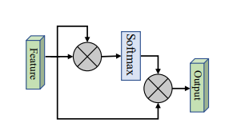
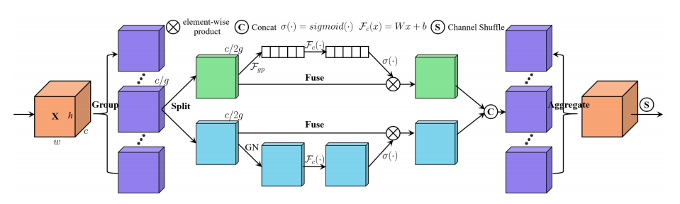
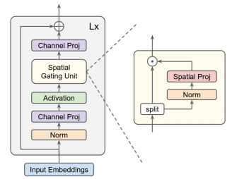
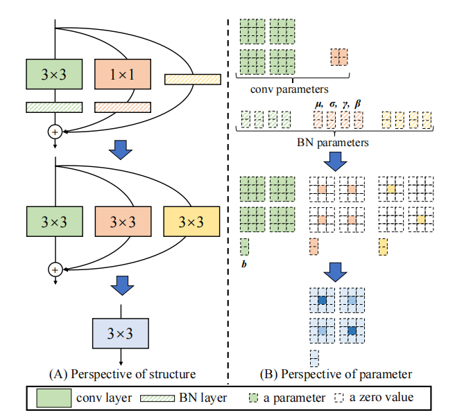

# Updates

<font size=4> If this project is helpful to you, welcome to give a <font  size=6 color=green>***star***</font>. Don't forget to <font  size=6 color=green>***follow***</font> me to learn about project updates. </font>

**【June 12，2021】** For the convenience use of this project, the *pip installation* method is provided. However, it is highly recommended that you **git clone** this project, because **pip install** may not be updated in a timely manner.

You can run the following command directly:
```
pip install dlutils_add
```

(.whl file can also be downloaded by [BaiDuYun](https://pan.baidu.com/s/11Ky_JwLolIVLDhMslumkng) (Extraction code: **c56j**).)


***

# Contents

- [Attention Series](#attention-series)
    - [1. External Attention Usage](#1-external-attention-usage)

    - [2. Self Attention Usage](#2-self-attention-usage)

    - [3. Simplified Self Attention Usage](#3-simplified-self-attention-usage)

    - [4. Squeeze-and-Excitation Attention Usage](#4-squeeze-and-excitation-attention-usage)

    - [5. SK Attention Usage](#5-sk-attention-usage)

    - [6. CBAM Attention Usage](#6-cbam-attention-usage)

    - [7. BAM Attention Usage](#7-bam-attention-usage)
    
    - [8. ECA Attention Usage](#8-eca-attention-usage)

    - [9. DANet Attention Usage](#9-danet-attention-usage)

    - [10. Pyramid Split Attention (PSA) Usage](#10-Pyramid-Split-Attention-Usage)

    - [11. Efficient Multi-Head Self-Attention(EMSA) Usage](#11-Efficient-Multi-Head-Self-Attention-Usage)

    - [12. Shuffle Attention Usage](#12-Shuffle-Attention-Usage)
  


- [MLP Series](#mlp-series)

    - [1. RepMLP Usage](#1-RepMLP-Usage)

    - [2. MLP-Mixer Usage](#2-MLP-Mixer-Usage)

    - [3. ResMLP Usage](#3-ResMLP-Usage)

    - [4. gMLP Usage](#4-gMLP-Usage)


- [Re-Parameter(ReP) Series](#Re-Parameter-series)

    - [1. RepVGG Usage](#1-RepVGG-Usage)

    - [2. ACNet Usage](#2-ACNet-Usage)


***


# Attention Series

- Pytorch implementation of ["Beyond Self-attention: External Attention using Two Linear Layers for Visual Tasks---arXiv 2020.05.05"](https://arxiv.org/abs/2105.02358)

- Pytorch implementation of ["Attention Is All You Need---NIPS2017"](https://arxiv.org/pdf/1706.03762.pdf)

- Pytorch implementation of ["Squeeze-and-Excitation Networks---CVPR2018"](https://arxiv.org/abs/1709.01507)

- Pytorch implementation of ["Selective Kernel Networks---CVPR2019"](https://arxiv.org/pdf/1903.06586.pdf)

- Pytorch implementation of ["CBAM: Convolutional Block Attention Module---ECCV2018"](https://openaccess.thecvf.com/content_ECCV_2018/papers/Sanghyun_Woo_Convolutional_Block_Attention_ECCV_2018_paper.pdf)

- Pytorch implementation of ["BAM: Bottleneck Attention Module---BMCV2018"](https://arxiv.org/pdf/1807.06514.pdf)

- Pytorch implementation of ["ECA-Net: Efficient Channel Attention for Deep Convolutional Neural Networks---CVPR2020"](https://arxiv.org/pdf/1910.03151.pdf)

- Pytorch implementation of ["Dual Attention Network for Scene Segmentation---CVPR2019"](https://arxiv.org/pdf/1809.02983.pdf)

- Pytorch implementation of ["EPSANet: An Efficient Pyramid Split Attention Block on Convolutional Neural Network---arXiv 2020.05.30"](https://arxiv.org/pdf/2105.14447.pdf)

- Pytorch implementation of ["ResT: An Efficient Transformer for Visual Recognition---arXiv 2020.05.28"](https://arxiv.org/abs/2105.13677)

- Pytorch implementation of ["SA-NET: SHUFFLE ATTENTION FOR DEEP CONVOLUTIONAL NEURAL NETWORKS---ICASSP 2021"](https://arxiv.org/pdf/2102.00240.pdf)


***


### 1. External Attention Usage
#### 1.1. Paper
["Beyond Self-attention: External Attention using Two Linear Layers for Visual Tasks"](https://arxiv.org/abs/2105.02358)

#### 1.2. Overview


#### 1.3. Code
```python
from attention.ExternalAttention import ExternalAttention
import torch

input=torch.randn(50,49,512)
ea = ExternalAttention(d_model=512,S=8)
output=ea(input)
print(output.shape)
```

***


### 2. Self Attention Usage
#### 2.1. Paper
["Attention Is All You Need"](https://arxiv.org/pdf/1706.03762.pdf)

#### 1.2. Overview


#### 1.3. Code
```python
from attention.SelfAttention import ScaledDotProductAttention
import torch

input=torch.randn(50,49,512)
sa = ScaledDotProductAttention(d_model=512, d_k=512, d_v=512, h=8)
output=sa(input,input,input)
print(output.shape)
```

***

### 3. Simplified Self Attention Usage
#### 3.1. Paper
[None]()

#### 3.2. Overview


#### 3.3. Code
```python
from attention.SimplifiedSelfAttention import SimplifiedScaledDotProductAttention
import torch

input=torch.randn(50,49,512)
ssa = SimplifiedScaledDotProductAttention(d_model=512, h=8)
output=ssa(input,input,input)
print(output.shape)

```

***

### 4. Squeeze-and-Excitation Attention Usage
#### 4.1. Paper
["Squeeze-and-Excitation Networks"](https://arxiv.org/abs/1709.01507)

#### 4.2. Overview


#### 4.3. Code
```python
from attention.SEAttention import SEAttention
import torch

input=torch.randn(50,512,7,7)
se = SEAttention(channel=512,reduction=8)
output=se(input)
print(output.shape)

```

***

### 5. SK Attention Usage
#### 5.1. Paper
["Selective Kernel Networks"](https://arxiv.org/pdf/1903.06586.pdf)

#### 5.2. Overview


#### 5.3. Code
```python
from attention.SKAttention import SKAttention
import torch

input=torch.randn(50,512,7,7)
se = SKAttention(channel=512,reduction=8)
output=se(input)
print(output.shape)

```
***

### 6. CBAM Attention Usage
#### 6.1. Paper
["CBAM: Convolutional Block Attention Module"](https://openaccess.thecvf.com/content_ECCV_2018/papers/Sanghyun_Woo_Convolutional_Block_Attention_ECCV_2018_paper.pdf)

#### 6.2. Overview


#### 6.3. Code
```python
from attention.CBAM import CBAMBlock
import torch

input=torch.randn(50,512,7,7)
kernel_size=input.shape[2]
cbam = CBAMBlock(channel=512,reduction=16,kernel_size=kernel_size)
output=cbam(input)
print(output.shape)

```

***

### 7. BAM Attention Usage
#### 7.1. Paper
["BAM: Bottleneck Attention Module"](https://arxiv.org/pdf/1807.06514.pdf)

#### 7.2. Overview


#### 7.3. Code
```python
from attention.BAM import BAMBlock
import torch

input=torch.randn(50,512,7,7)
bam = BAMBlock(channel=512,reduction=16,dia_val=2)
output=bam(input)
print(output.shape)

```

***

### 8. ECA Attention Usage
#### 8.1. Paper
["ECA-Net: Efficient Channel Attention for Deep Convolutional Neural Networks"](https://arxiv.org/pdf/1910.03151.pdf)

#### 8.2. Overview


#### 8.3. Code
```python
from attention.ECAAttention import ECAAttention
import torch

input=torch.randn(50,512,7,7)
eca = ECAAttention(kernel_size=3)
output=eca(input)
print(output.shape)

```

***

### 9. DANet Attention Usage
#### 9.1. Paper
["Dual Attention Network for Scene Segmentation"](https://arxiv.org/pdf/1809.02983.pdf)

#### 9.2. Overview


#### 9.3. Code
```python
from attention.DANet import DAModule
import torch

input=torch.randn(50,512,7,7)
danet=DAModule(d_model=512,kernel_size=3,H=7,W=7)
print(danet(input).shape)

```

***

### 10. Pyramid Split Attention Usage

#### 10.1. Paper
["EPSANet: An Efficient Pyramid Split Attention Block on Convolutional Neural Network"](https://arxiv.org/pdf/2105.14447.pdf)

#### 10.2. Overview


#### 10.3. Code
```python
from attention.PSA import PSA
import torch

input=torch.randn(50,512,7,7)
psa = PSA(channel=512,reduction=8)
output=psa(input)
print(output.shape)

```

***


### 11. Efficient Multi-Head Self-Attention Usage

#### 11.1. Paper
["ResT: An Efficient Transformer for Visual Recognition"](https://arxiv.org/abs/2105.13677)

#### 11.2. Overview


#### 11.3. Code
```python

from attention.EMSA import EMSA
import torch
from torch import nn
from torch.nn import functional as F

input=torch.randn(50,64,512)
emsa = EMSA(d_model=512, d_k=512, d_v=512, h=8,H=8,W=8,ratio=2,apply_transform=True)
output=emsa(input,input,input)
print(output.shape)
    
```

***


### 12. Shuffle Attention Usage

#### 12.1. Paper
["SA-NET: SHUFFLE ATTENTION FOR DEEP CONVOLUTIONAL NEURAL NETWORKS"](https://arxiv.org/pdf/2102.00240.pdf)

#### 12.2. Overview


#### 12.3. Code
```python

from attention.ShuffleAttention import ShuffleAttention
import torch
from torch import nn
from torch.nn import functional as F


input=torch.randn(50,512,7,7)
se = ShuffleAttention(channel=512,G=8)
output=se(input)
print(output.shape)

    
```


***

# MLP Series

- Pytorch implementation of ["RepMLP: Re-parameterizing Convolutions into Fully-connected Layers for Image Recognition---arXiv 2020.05.05"](https://arxiv.org/pdf/2105.01883v1.pdf)

- Pytorch implementation of ["MLP-Mixer: An all-MLP Architecture for Vision---arXiv 2020.05.17"](https://arxiv.org/pdf/2105.01601.pdf)

- Pytorch implementation of ["ResMLP: Feedforward networks for image classification with data-efficient training---arXiv 2020.05.07"](https://arxiv.org/pdf/2105.03404.pdf)

- Pytorch implementation of ["Pay Attention to MLPs---arXiv 2020.05.17"](https://arxiv.org/abs/2105.08050)

### 1. RepMLP Usage
#### 1.1. Paper
["RepMLP: Re-parameterizing Convolutions into Fully-connected Layers for Image Recognition"](https://arxiv.org/pdf/2105.01883v1.pdf)

#### 1.2. Overview


#### 1.3. Code
```python
from mlp.repmlp import RepMLP
import torch
from torch import nn

N=4 #batch size
C=512 #input dim
O=1024 #output dim
H=14 #image height
W=14 #image width
h=7 #patch height
w=7 #patch width
fc1_fc2_reduction=1 #reduction ratio
fc3_groups=8 # groups
repconv_kernels=[1,3,5,7] #kernel list
repmlp=RepMLP(C,O,H,W,h,w,fc1_fc2_reduction,fc3_groups,repconv_kernels=repconv_kernels)
x=torch.randn(N,C,H,W)
repmlp.eval()
for module in repmlp.modules():
    if isinstance(module, nn.BatchNorm2d) or isinstance(module, nn.BatchNorm1d):
        nn.init.uniform_(module.running_mean, 0, 0.1)
        nn.init.uniform_(module.running_var, 0, 0.1)
        nn.init.uniform_(module.weight, 0, 0.1)
        nn.init.uniform_(module.bias, 0, 0.1)

#training result
out=repmlp(x)
#inference result
repmlp.switch_to_deploy()
deployout = repmlp(x)

print(((deployout-out)**2).sum())
```

### 2. MLP-Mixer Usage
#### 2.1. Paper
["MLP-Mixer: An all-MLP Architecture for Vision"](https://arxiv.org/pdf/2105.01601.pdf)

#### 2.2. Overview


#### 2.3. Code
```python
from mlp.mlp_mixer import MlpMixer
import torch
mlp_mixer=MlpMixer(num_classes=1000,num_blocks=10,patch_size=10,tokens_hidden_dim=32,channels_hidden_dim=1024,tokens_mlp_dim=16,channels_mlp_dim=1024)
input=torch.randn(50,3,40,40)
output=mlp_mixer(input)
print(output.shape)
```

***

### 3. ResMLP Usage
#### 3.1. Paper
["ResMLP: Feedforward networks for image classification with data-efficient training"](https://arxiv.org/pdf/2105.03404.pdf)

#### 3.2. Overview


#### 3.3. Code
```python
from mlp.resmlp import ResMLP
import torch

input=torch.randn(50,3,14,14)
resmlp=ResMLP(dim=128,image_size=14,patch_size=7,class_num=1000)
out=resmlp(input)
print(out.shape) #the last dimention is class_num
```

***

### 4. gMLP Usage
#### 4.1. Paper
["Pay Attention to MLPs"](https://arxiv.org/abs/2105.08050)

#### 4.2. Overview


#### 4.3. Code
```python
from mlp.g_mlp import gMLP
import torch

num_tokens=10000
bs=50
len_sen=49
num_layers=6
input=torch.randint(num_tokens,(bs,len_sen)) #bs,len_sen
gmlp = gMLP(num_tokens=num_tokens,len_sen=len_sen,dim=512,d_ff=1024)
output=gmlp(input)
print(output.shape)
```


# Re-Parameter Series

- Pytorch implementation of ["RepVGG: Making VGG-style ConvNets Great Again---CVPR2021"](https://arxiv.org/abs/2101.03697)

- Pytorch implementation of ["ACNet: Strengthening the Kernel Skeletons for Powerful CNN via Asymmetric Convolution Blocks---ICCV2019"](https://arxiv.org/abs/1908.03930)


***

### 1. RepVGG Usage
#### 1.1. Paper
["RepVGG: Making VGG-style ConvNets Great Again"](https://arxiv.org/abs/2101.03697)

#### 1.2. Overview


#### 1.3. Code
```python

from rep.repvgg import RepBlock
import torch


input=torch.randn(50,512,49,49)
repblock=RepBlock(512,512)
repblock.eval()
out=repblock(input)
repblock._switch_to_deploy()
out2=repblock(input)
print('difference between vgg and repvgg')
print(((out2-out)**2).sum())
```


***

### 2. ACNet Usage
#### 2.1. Paper
["ACNet: Strengthening the Kernel Skeletons for Powerful CNN via Asymmetric Convolution Blocks"](https://arxiv.org/abs/1908.03930)

#### 2.2. Overview


#### 2.3. Code
```python
from rep.acnet import ACNet
import torch
from torch import nn

input=torch.randn(50,512,49,49)
acnet=ACNet(512,512)
acnet.eval()
out=acnet(input)
acnet._switch_to_deploy()
out2=acnet(input)
print('difference:')
print(((out2-out)**2).sum())

```
