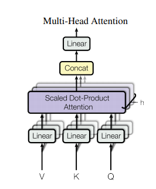
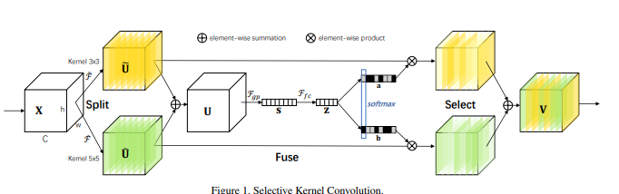
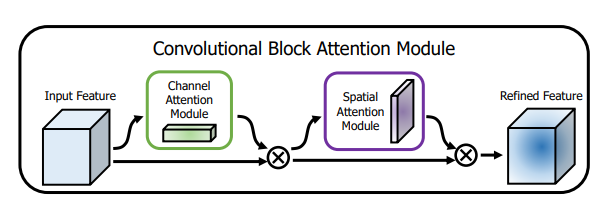
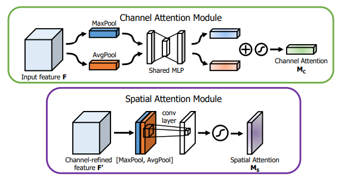
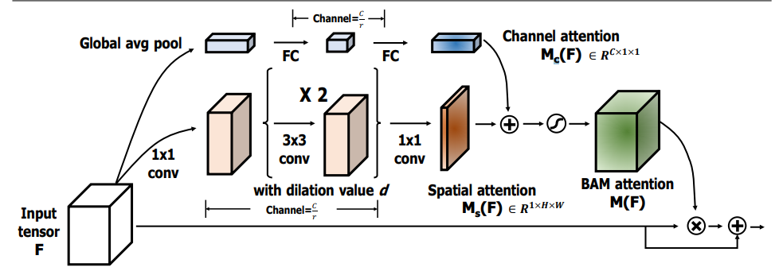
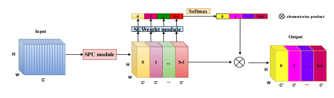

## 目录
  
- [1. External Attention](#1-external-attention)

- [2. Self Attention](#2-self-attention)

- [3. Squeeze-and-Excitation(SE) Attention](#3-squeeze-and-excitationse-attention)

- [4. Selective Kernel(SK) Attention](#4-selective-kernelsk-attention)

- [5. CBAM Attention](#5-cbam-attention)

- [6. BAM Attention](#6-bam-attention)

- [7. ECA Attention](#7-eca-attention)

- [8. DANet Attention](#8-danet-attention)

- [9. Pyramid Split Attention(PSA)](#9-pyramid-split-attentionpsa)

- [10. Efficient Multi-Head Self-Attention(EMSA)](#10-efficient-multi-head-self-attentionemsa)

- [【写在最后】](#写在最后)


## 1. External Attention

### 1.1. 引用

Beyond Self-attention: External Attention using Two Linear Layers for Visual Tasks.---arXiv 2021.05.05

论文地址：[https://arxiv.org/abs/2105.02358](https://arxiv.org/abs/2105.02358)

### 1.2. 模型结构


### 1.3. 简介

这是五月份在arXiv上的一篇文章，主要解决的Self-Attention(SA)的两个痛点问题：（1）O(n^2)的计算复杂度；(2)SA是在同一个样本上根据不同位置计算Attention，忽略了不同样本之间的联系。因此，本文采用了两个串联的MLP结构作为memory units，使得计算复杂度降低到了O(n)；此外，这两个memory units是基于全部的训练数据学习的，因此也隐式的考虑了不同样本之间的联系。

### 1.4. 使用方法

```python
from attention.ExternalAttention import ExternalAttention
import torch


input=torch.randn(50,49,512)
ea = ExternalAttention(d_model=512,S=8)
output=ea(input)
print(output.shape)
```


## 2. Self Attention

### 2.1. 引用

Attention Is All You Need---NeurIPS2017

论文地址：[https://arxiv.org/abs/1706.03762](https://arxiv.org/abs/1706.03762)

### 2.2. 模型结构



### 2.3. 简介

这是Google在NeurIPS2017发表的一篇文章，在CV、NLP、多模态等各个领域都有很大的影响力，目前引用量已经2.2w+。Transformer中提出的Self-Attention是Attention的一种，用于计算特征中不同位置之间的权重，从而达到更新特征的效果。首先将input feature通过FC映射成Q、K、V三个特征，然后将Q和K进行点乘的得到attention map，在将attention map与V做点乘得到加权后的特征。最后通过FC进行特征的映射，得到一个新的特征。（关于Transformer和Self-Attention目前网上有许多非常好的讲解，这里就不做详细的介绍了）

### 2.4. 使用方法

```python
from attention.SelfAttention import ScaledDotProductAttention
import torch

input=torch.randn(50,49,512)
sa = ScaledDotProductAttention(d_model=512, d_k=512, d_v=512, h=8)
output=sa(input,input,input)
print(output.shape)
```


## 3. Squeeze-and-Excitation(SE) Attention

### 3.1. 引用

Squeeze-and-Excitation Networks---CVPR2018

论文地址：[https://arxiv.org/abs/1709.01507](https://arxiv.org/abs/1709.01507)

### 3.2. 模型结构


### 3.3. 简介

这是CVPR2018的一篇文章，同样非常具有影响力，目前引用量7k+。本文是做通道注意力的，因其简单的结构和有效性，将通道注意力掀起了一波小高潮。大道至简，这篇文章的思想可以说非常简单，首先将spatial维度进行AdaptiveAvgPool，然后通过两个FC学习到通道注意力，并用Sigmoid进行归一化得到Channel Attention Map,最后将Channel Attention Map与原特征相乘，就得到了加权后的特征。

### 3.4. 使用方法

```python
from attention.SEAttention import SEAttention
import torch

input=torch.randn(50,512,7,7)
se = SEAttention(channel=512,reduction=8)
output=se(input)
print(output.shape)
```


 

## 4. Selective Kernel(SK) Attention

### 4.1. 引用

Selective Kernel Networks---CVPR2019

论文地址：[https://arxiv.org/pdf/1903.06586.pdf](https://arxiv.org/pdf/1903.06586.pdf)

### 4.2. 模型结构



### 4.3. 简介

这是CVPR2019的一篇文章，致敬了SENet的思想。在传统的CNN中每一个卷积层都是用相同大小的卷积核，限制了模型的表达能力；而Inception这种“更宽”的模型结构也验证了，用多个不同的卷积核进行学习确实可以提升模型的表达能力。作者借鉴了SENet的思想，通过动态计算每个卷积核得到通道的权重，动态的将各个卷积核的结果进行融合。

个人认为，之所以所这篇文章也能够称之为lightweight，是因为对不同kernel的特征进行通道注意力的时候是参数共享的（i.e. 因为在做Attention之前，首先将特征进行了融合，所以不同卷积核的结果共享一个SE模块的参数）。

本文的方法分为三个部分：Split,Fuse,Select。Split就是一个multi-branch的操作，用不同的卷积核进行卷积得到不同的特征；Fuse部分就是用SE的结构获取通道注意力的矩阵(N个卷积核就可以得到N个注意力矩阵，这步操作对所有的特征参数共享)，这样就可以得到不同kernel经过SE之后的特征；Select操作就是将这几个特征进行相加。

### 4.4. 使用方法

```python
from attention.SKAttention import SKAttention
import torch

input=torch.randn(50,512,7,7)
se = SKAttention(channel=512,reduction=8)
output=se(input)
print(output.shape)
```


 

## 5. CBAM Attention

### 5.1. 引用

CBAM: Convolutional Block Attention Module---ECCV2018

论文地址：[https://openaccess.thecvf.com/content_ECCV_2018/papers/Sanghyun_Woo_Convolutional_Block_Attention_ECCV_2018_paper.pdf](https://openaccess.thecvf.com/content_ECCV_2018/papers/Sanghyun_Woo_Convolutional_Block_Attention_ECCV_2018_paper.pdf)

### 5.2. 模型结构





### 5.3. 简介

这是ECCV2018的一篇论文，这篇文章同时使用了Channel Attention和Spatial Attention，将两者进行了串联（文章也做了并联和两种串联方式的消融实验）。

Channel Attention方面，大致结构还是和SE相似，不过作者提出AvgPool和MaxPool有不同的表示效果，所以作者对原来的特征在Spatial维度分别进行了AvgPool和MaxPool，然后用SE的结构提取channel attention，注意这里是参数共享的，然后将两个特征相加后做归一化，就得到了注意力矩阵。

Spatial Attention和Channel Attention类似，先在channel维度进行两种pool后，将两个特征进行拼接，然后用7x7的卷积来提取Spatial Attention（之所以用7x7是因为提取的是空间注意力，所以用的卷积核必须足够大）。然后做一次归一化，就得到了空间的注意力矩阵。

### 5.4. 使用方法

```python
from attention.CBAM import CBAMBlock
import torch

input=torch.randn(50,512,7,7)
kernel_size=input.shape[2]
cbam = CBAMBlock(channel=512,reduction=16,kernel_size=kernel_size)
output=cbam(input)
print(output.shape)
```


 

## 6. BAM Attention

### 6.1. 引用

BAM: Bottleneck Attention Module---BMCV2018

论文地址：[https://arxiv.org/pdf/1807.06514.pdf](https://arxiv.org/pdf/1807.06514.pdf)

### 6.2. 模型结构



### 6.3. 简介

这是CBAM同作者同时期的工作，工作与CBAM非常相似，也是双重Attention，不同的是CBAM是将两个attention的结果串联；而BAM是直接将两个attention矩阵进行相加。

Channel Attention方面，与SE的结构基本一样。Spatial Attention方面，还是在通道维度进行pool，然后用了两次3x3的空洞卷积，最后将用一次1x1的卷积得到Spatial Attention的矩阵。

最后Channel Attention和Spatial Attention矩阵进行相加（这里用到了广播机制），并进行归一化，这样一来，就得到了空间和通道结合的attention矩阵。

### 6.4.使用方法

```python
from attention.BAM import BAMBlock
import torch

input=torch.randn(50,512,7,7)
bam = BAMBlock(channel=512,reduction=16,dia_val=2)
output=bam(input)
print(output.shape)
```


## 7. ECA Attention

### 7.1. 引用

ECA-Net: Efficient Channel Attention for Deep Convolutional Neural Networks---CVPR2020

论文地址：[https://arxiv.org/pdf/1910.03151.pdf](https://arxiv.org/pdf/1910.03151.pdf)

### 7.2. 模型结构


### 7.3. 简介

这是CVPR2020的一篇文章。

如上图所示，SE实现通道注意力是使用两个全连接层，而ECA是需要一个的卷积。作者这么做的原因一方面是认为计算所有通道两两之间的注意力是没有必要的，另一方面是用两个全连接层确实引入了太多的参数和计算量。

因此作者进行了AvgPool之后，只是使用了一个感受野为k的一维卷积（相当于只计算与相邻k个通道的注意力），这样做就大大的减少的参数和计算量。(i.e.相当于SE是一个global的注意力，而ECA是一个local的注意力)。

### 7.4. 使用方法：

```python
from attention.ECAAttention import ECAAttention
import torch

input=torch.randn(50,512,7,7)
eca = ECAAttention(kernel_size=3)
output=eca(input)
print(output.shape)
```


 

## 8. DANet Attention

### 8.1. 引用

Dual Attention Network for Scene Segmentation---CVPR2019

论文地址：[https://arxiv.org/pdf/1809.02983.pdf](https://arxiv.org/pdf/1809.02983.pdf)

### 8.2. 模型结构


### 8.3. 简介

这是CVPR2019的文章，思想上非常简单，就是将self-attention用到场景分割的任务中，不同的是self-attention是关注每个position之间的注意力，而本文将self-attention做了一个拓展，还做了一个通道注意力的分支，操作上和self-attention一样，不同的通道attention中把生成Q，K，V的三个Linear去掉了。最后将两个attention之后的特征进行element-wise sum。

### 8.4. 使用方法

```python
from attention.DANet import DAModule
import torch

input=torch.randn(50,512,7,7)
danet=DAModule(d_model=512,kernel_size=3,H=7,W=7)
print(danet(input).shape)
```


 

## 9. Pyramid Split Attention(PSA)

### 9.1. 引用

EPSANet: An Efficient Pyramid Split Attention Block on Convolutional Neural Network---arXiv 2021.05.30

论文地址：[https://arxiv.org/pdf/2105.14447.pdf](https://arxiv.org/pdf/2105.14447.pdf)

### 9.2. 模型结构




### 9.3. 简介

这是深大5月30日在arXiv上上传的一篇文章，本文的目的是如何获取并探索不同尺度的空间信息来丰富特征空间。网络结构相对来说也比较简单，主要分成四步，第一步，将原来的feature根据通道分成n组然后对不同的组进行不同尺度的卷积，得到新的特征W1；第二步，用SE在原来的特征上进行SE，从而获得不同的Attention Map；第三步，对不同组进行SOFTMAX；第四步，将获得attention与原来的特征W1相乘。

### 9.4. 使用方法

```python
from attention.PSA import PSA
import torch

input=torch.randn(50,512,7,7)
psa = PSA(channel=512,reduction=8)
output=psa(input)
print(output.shape)
```


 

## 10. Efficient Multi-Head Self-Attention(EMSA)

### 10.1. 引用

ResT: An Efficient Transformer for Visual Recognition---arXiv 2021.05.28

论文地址：[https://arxiv.org/abs/2105.13677](https://arxiv.org/abs/2105.13677)

### 10.2. 模型结构


### 10.3. 简介

这是南大5月28日在arXiv上上传的一篇文章。本文解决的主要是SA的两个痛点问题：（1）Self-Attention的计算复杂度和n呈平方关系；（2）每个head只有q,k,v的部分信息，如果q,k,v的维度太小，那么就会导致获取不到连续的信息，从而导致性能损失。这篇文章给出的思路也非常简单，在SA中，在FC之前，用了一个卷积来降低了空间的维度，从而得到空间维度上更小的K和V。

### 10.4. 使用方法

```python
from attention.EMSA import EMSA
import torch
from torch import nn
from torch.nn import functional as F

input=torch.randn(50,64,512)
emsa = EMSA(d_model=512, d_k=512, d_v=512, h=8,H=8,W=8,ratio=2,apply_transform=True)
output=emsa(input,input,input)
print(output.shape)
```


 

## 【写在最后】

目前该项目整理的Attention的工作确实还不够全面，后面随着阅读量的提高，会不断对本项目进行完善，欢迎大家star支持。若在文章中有表述不恰、代码实现有误的地方，欢迎大家指出~